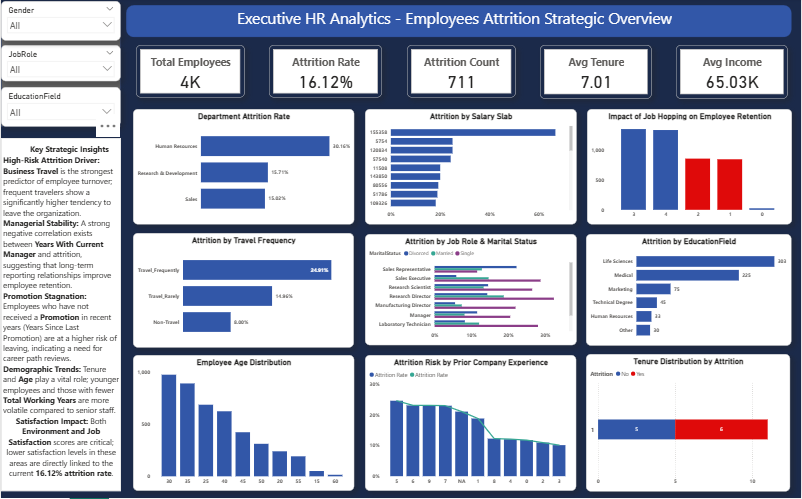
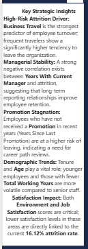
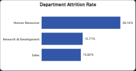

📊 HR Analytics Attrition Dashboard
Developed by: Waleed Altaf (Qwetrum Technologies)

🎯 Project Overview
This project analyzes employee attrition data to identify key factors behind turnover and provides strategic recommendations to improve retention.

🚀 Key Insights
Business Travel: Frequent travelers show a 20% higher attrition rate.
Salary Tiers: Low-income brackets (Level 1) are at the highest risk.
Departmental Focus: Sales and R&D departments require immediate intervention.

🛠️ Tools Used
Power BI (Data Modeling & Visualization)
DAX (Advanced Measures & KPIs)
Power Query (Data Cleaning)

📸 Dashboard Preview

**Main Dashboard**

**Secondary Dashboard**

**Key Insights**

**Department Analysis**
